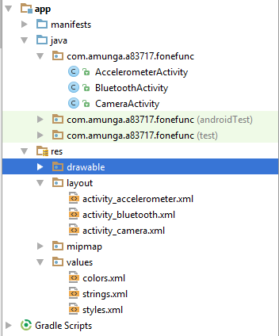

# FoneFunk
Android Mobile Application with basic Phone functionalities including Bluetooth, Camera and Accelerometer

Before you begin ensure that you create 3 empty activities namely Bluetooth,Accelerometer and Camera like below

 
 
 Next,
 Copy all the XML in layout files from the res/layout and place them in your layout files
 
 
Since this project was developed for Android Studio 2.3. For people with Android Studio 2.2 and below who have a Relative Layout as the default layout copy the xml put under the <strong>res under</strong> folder and place it within the Relative Layout tags
 
